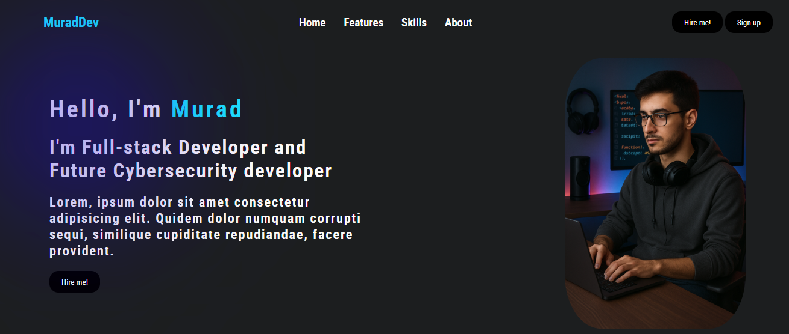
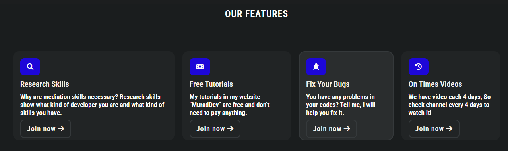
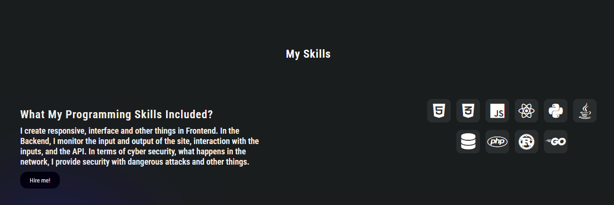
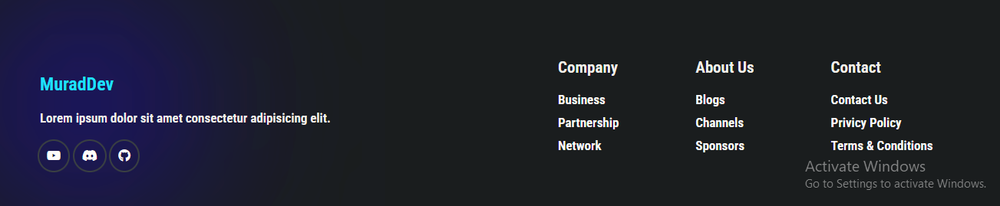

# My Portfolio Website
* This is my first portfolio website built with HTML, CSS, and JavaScript.
* My goal was to create a simple portfolio site as my first experience.
* The code may be a bit long and basic, but I will improve it next time!

# HTML
* Fixed navbar with links to Home, Features, Skills, and About sections.

* The main section includes my name, a short description, a button, and an image.

* Features section describes my main features.

* Skills section lists my skills.

* About section includes information about me and sponsorship.

# CSS
* Added fonts, colors, blur effects, and hover styles to enhance appearance.

# JavaScript
* Added smooth scrolling to navbar links using the scrollIntoView method.

* Added an event listener to handle navigation clicks for scrolling behavior.

# Projects screenshorts

## Home page

## Features page

## Skills page

## About page
